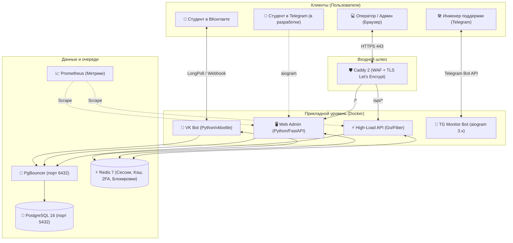

# OSS Bot v0.8.9.1 🎓

[](https://github.com/KOngfrost/Student_bot/actions/workflows/ci.yml)
[](LICENSE)
[](https://www.python.org/)
[](https://golang.org/)
[](tests/)
[](SECURITY.md)
[](CONTRIBUTING.md)

> **OSS Bot** — современная омниканальная платформа для приёма, маршрутизации и обработки обращений студентов университета.  
> Объединяет интерфейсы общения для студентов (ВКонтакте, Telegram), защищённую веб-панель для операторов и сервисы мониторинга в единую надёжную экосистему.

---

## 🧭 Быстрая навигация

- [✨ Ключевые возможности](#-ключевые-возможности)
- [🏗️ Архитектура системы](#️-архитектура-системы)
- [🚀 Быстрый старт (в 1 команду или за 3 шага)](#-быстрый-старт)
- [👥 Контуры и роли пользователей](#-контуры-и-роли-пользователей)
- [🛠️ Технологический стек](#️-технологический-стек)
- [📚 База знаний и документация](#-база-знаний-и-документация)
- [🤝 Сообщество, контрибьютинг и защита от Bus Factor](#-сообщество-контрибьютинг-и-защита-от-bus-factor)
- [📄 Лицензия](#-лицензия)

---

## ✨ Ключевые возможности

- 📩 **Омниканальность обращений**: студенты пишут в привычный мессенджер (ВК, в разработке Telegram), а операторы работают в едином удобном веб-интерфейсе.
- ⚡ **Гарантированная доставка (Transactional Outbox)**: ни один ответ оператора и ни одно уведомление студенту не потеряются даже при сбоях сети или API.
- 🔒 **Многоуровневая безопасность**:
  - Двухфакторная аутентификация (2FA) через личные сообщения с хешированием Argon2id.
  - Распределённое ограничение частоты запросов (DBRateLimiter против брутфорса).
  - Защитный шлюз Caddy с веб-файрволом (WAF), автоматическими HTTPS-сертификатами Let's Encrypt и HSTS.
  - Startup Guard — автоматическая блокировка запуска при небезопасных стандартных паролях.
- 🏢 **Разделение по отделам**: Студсовет, Жилищно-бытовой, Культурно-массовый, Информационный, Корпоративный отделы видят только свои профильные заявки.
- 🎭 **Анонимные обращения**: возможность для студентов задавать деликатные вопросы без раскрытия личных данных.
- 📅 **Афиша мероприятий**: публикация событий с лимитами мест и мгновенной записью прямо из чата бота.
- 📊 **Журнал аудита и аналитика**: полное логирование действий операторов, экспорт в CSV, метрики для Prometheus.

---

## 🏗️ Архитектура системы

Система построена на микросервисных принципах и запускается в Docker-контейнерах:



---

## 🚀 Быстрый старт

### Вариант А. Автоматический запуск в 1 команду (Рекомендуется)
Скрипт автоматически проверит Docker, создаст `.env` с криптостойкими паролями, применит миграции и поднимет все сервисы:
```bash
git clone https://github.com/KOngfrost/Student_bot.git /opt/oss_bot
cd /opt/oss_bot
bash scripts/quickstart.sh
```

### Вариант Б. Ручной пошаговый запуск

#### Шаг 1. Клонирование и настройка окружения
```bash
git clone https://github.com/KOngfrost/Student_bot.git /opt/oss_bot
cd /opt/oss_bot
cp .env.example .env
```
Отредактируйте `.env`: укажите токен сообщества VK, секретные ключи и надёжные пароли.

#### Шаг 2. Запуск сервисов и применение миграций
```bash
# Применение миграций схемы базы данных
docker compose run --rm migrate

# Фоновый запуск всех сервисов проекта
docker compose up -d --build
```

#### Шаг 3. Проверка здоровья
```bash
docker compose ps
curl -s http://127.0.0.1:8000/health
```
После старта веб-панель доступна по адресу `https://ваш-домен/` (или `http://localhost:8000` при локальной разработке).

### Обновление Python-зависимостей
Редактируйте исходный список `requirements.in`, затем в окружении Python 3.11 выполните:
```bash
python -m pip install pip-tools
pip-compile --generate-hashes --resolver=backtracking --pip-args="--python-version=3.11 --only-binary=:all:" --output-file=requirements.txt requirements.in
```
Проверьте изменения и тесты, после чего пересоберите образы командой `docker compose build`.

---

## 👥 Контуры и роли пользователей

| Роль | Основной инструмент | Что доступно |
|---|---|---|
| **Студент** | VK-бот (`@oss_bot`) | Подача заявок (открытых и анонимных), отслеживание статуса, FAQ, запись на мероприятия. |
| **Оператор отдела** | Веб-панель (`/admin`) | Ответы на заявки своего отдела, управление вопросами FAQ своего отдела, статьи базы знаний. |
| **Суперадминистратор** | Веб-панель (`/admin`) | Управление всеми заявками, переназначение отделов, создание пользователей, аудит, системные настройки. |
| **Инженер мониторинга** | Telegram-бот инженера | Оповещения о сбоях, просмотр статуса контейнеров, управление режимом техработ. |

---

## 🛠️ Технологический стек

- **Основной бэкенд**: Python 3.14, FastAPI, SQLAlchemy 2.0 (async), Pydantic v2.
- **Высоконагруженный API**: Go 1.23, Fiber v2 (в каталоге `backend_go/`).
- **Интерфейс бота ВК**: `vkbottle` 4.x (поддержка Long Poll и Callback API).
- **Бот мониторинга**: Python, `aiogram` 3.x.
- **База данных**: PostgreSQL 16 + пул транзакций **PgBouncer** (порт 6432).
- **Кэш и сессии**: Redis 7 (хранение сессий, Argon2id OTP-кодов 2FA, распределённых блокировок).
- **Сетевой шлюз и безопасность**: Caddy 2 (TLS Let's Encrypt, HTTP/3, WAF, Security Headers).
- **Веб-интерфейс**: Jinja2, Tailwind CSS, HTMX.
- **Тестирование**: `pytest` (449+ тестов: unit, integration, smoke) + `Playwright` (браузерные E2E).

---

## 📚 База знаний и документация

Вся документация проекта структурирована по направлениям:

| Руководство | Для кого предназначено | О чём документ |
|---|---|---|
| 📖 [**Руководство оператора**](docs/OPERATOR_GUIDE.md) | Операторы отделов, студенты | Пошаговые сценарии работы с заявками, FAQ, мероприятиями и ботом. |
| 🖥️ [**Гид по веб-панели**](docs/WEB_ADMIN_GUIDE.md) | Операторы, администраторы | Обзор страниц, горячие клавиши, живой поиск, 2FA и аудит. |
| 🚀 [**Руководство по развёртыванию**](docs/DEPLOYMENT.md) | DevOps, системные администраторы | Установка с нуля на чистый Linux-сервер, Docker, Caddy, SSL. |
| 🛡️ [**Регламент эксплуатации и DR**](docs/OPERATIONS_AND_DISASTER_RECOVERY.md) | DevOps, SRE, сисадмины | Бэкапы, восстановление после сбоев, Prometheus алерты, миграции версий. |
| ⚡ [**Нагрузочные тесты и бенчмарки**](docs/PERFORMANCE_AND_BENCHMARKS.md) | Архитекторы, Tech Lead | Опубликованные замеры Locust, сравнение Go Fiber и Python FastAPI, RPS/задержки. |
| 🔒 [**Политика безопасности**](SECURITY.md) | Инженеры ИБ, аудиторы | Модель угроз, 2FA (Argon2id), шифрование сессий (Fernet), WAF, ответственное раскрытие. |
| 🛠️ [**Администрирование и БД**](docs/ADMIN_AND_DATABASE_GUIDE.md) | Сисадмины, разработчики | Управление пользователями через консоль, бэкапы, Redis, PgBouncer. |
| 📐 [**Техническая спецификация**](TECHNICAL_SPEC.md) | Разработчики, архитекторы | Детальное описание слоёв, паттерна Outbox, безопасности и структуры кода. |
| 🗄️ [**Схема базы данных**](docs/DATABASE_SCHEMA.md) | Backend-разработчики | Таблицы, связи, Mermaid ER-диаграмма, типы колонок. |
| 📈 [**Высокая доступность и масштабирование**](docs/HA_AND_SCALING_GUIDE.md) | DevOps, Tech Lead | PgBouncer, VK Callback API, мультиворкерность, тесты Locust. |
| 🗺️ [**Дорожная карта (Roadmap)**](ROADMAP.md) | Все участники команды | Что сделано и планы на следующие релизы (TMA, Android, AI). |
| 📝 [**История изменений (Changelog)**](CHANGELOG.md) | Все участники команды | Хронология версий, исправления ошибок и новые функции. |

---

## 🔮 Планы развития

- **Фаза 3 (В разработке)**: Запуск официального студенческого Telegram-бота с единым ядром обращений.
- **Фаза 4**: Telegram Mini App (TMA на React) для моментального ответа операторов с телефонов.
- **Фаза 5**: Нативное Android-приложение для операторов и дежурных студсовета (Kotlin / Jetpack Compose).
- **Фаза 6**: Интеллектуальная автомаршрутизация заявок с помощью нейросетевой классификации и WebSocket-чаты в реальном времени.

---

## 🤝 Сообщество, контрибьютинг и защита от Bus Factor

Проект разрабатывается открытым сообществом с распределёнными ролями, исключающими зависимость от одного человека (*Bus factor mitigation*):
- 🐛 **Сообщить об ошибке**: Создайте тикет в [GitHub Issues](https://github.com/KOngfrost/Student_bot/issues) по готовому шаблону.
- 💡 **Предложить идею**: Опишите предложение через [Feature Request](https://github.com/KOngfrost/Student_bot/issues/new?template=feature_request.md).
- 🚀 **Внести свой код**: Ознакомьтесь с [Руководством контрибьютора (CONTRIBUTING.md)](CONTRIBUTING.md) — описан запуск тестов, проверка линтерами (`ruff`, `mypy`) и правила оформления Pull Request.

---

## 📄 Лицензия

Исходный код распространяется под свободной и открытой лицензией **[MIT](LICENSE)**.  
Вы можете свободно использовать, модифицировать и разворачивать систему в своём вузе или организации.

*Проект поддерживается объединённой командой Студенческого совета университета. Версия 0.8.9.1.*

